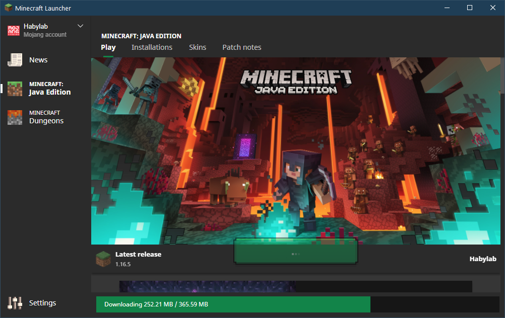

# Создание портативной сборки
В данном руководстве будет продемонстрировано создание своей кастомной сборки Minecraft на примере ОС Windows.

## Подготовка
1. Создаём рабочую директорию.
В моём случае это `G:\Minecraft`.
``` batch
mkdir G:\Minecraft
G:
cd Minecraft
mkdir bin
mkdir game
```

2. Запускаем официальный **Minecraft Launcher**, выбираем версию и скачивает игру, а с ней и необходимые файлы.


3. По окончании загрузки и запуска игры копируем бинарные библиотеки в рабочую директорию и закрываем игру. Она нам больше не понадобится.
``` batch
xcopy %appdata%\.minecraft\bin\1c1d-a80c-5999-cc54 bin /s
```

4. Копируем остальные файлы:
``` batch
xcopy %appdata%\.minecraft\assets assets /s
xcopy %appdata%\.minecraft\libraries libs /s
xcopy %appdata%\.minecraft\versions\1.16.5 vers /s
```

## Генерация LIBRARIES_LIST
Клонируем Git репозиторий [лаунчера](https://github.com/iiiypuk/minecraft-launcher) и устанавливаем зависимости Python скрипта:
``` batch
git clone --depth 1 git@github.com:iiiypuk/minecraft-launcher.git
cd minecraft-launcher

pip install -r requirements.txt
```

Генерируем `LIBRARIES_LIST` и перемещаем его в корень сборки:
``` batch
cd tools

copy ..\..\vers\1.16.5.json version.json

python make_libs_list.py --platform win32 --output txt

move libs.txt ..\..\vers

cd ..\..
```

## Редактирование лаунчера

0. Удаляем эти строку, если нет необходимости спрашивать имя пользователя
``` batch
set /p player=What username would you like? 
```

1. Изменяем переменную с директорией Minecraft `set MC_DIR=%CD%`
2. Изменяем путь к директории с файлами пользователя `set GAME_DIR=%MC_DIR%\game`
3. Изменяем путь к бинарным библиотекам `set NATIVES_DIR=%MC_DIR%\bin`
4. Заменяем в файле `libs.txt` фразы:
* `;%MC_DIR%/versions/%GAME_VERSION%/%GAME_VERSION%.jar` на `;%MC_DIR%/vers/%GAME_VERSION%.jar`
* `%MC_DIR%/libraries/` на `%MC_DIR%/libs/`
5. Копируем содержимое `libs.txt` в **%LIBRARIES_LIST%**

?> Вставить содержимое файла в перменную интерактивно  
таким образом `set /p LIBRARIES_LIST=<vers\libs.txt` не получится.  
Ограничение по длине :(

6. Удаляем строки
``` batch
%SystemDrive%
cd %MC_DIR%
```

## Готово
Получится что-то вроде этого:


Полный листинг скрипта:
```batch
rem @echo off
title Minecraft Launcher Portable

set MC_DIR=%CD%
set GAME_DIR=%MC_DIR%\game
set ASSETS_DIR=%MC_DIR%\assets
set ASSETS_INDEX=1.16
set GAME_VERSION=1.16.5
set NATIVES_DIR=%MC_DIR%\bin

set LIBRARIES_LIST=%MC_DIR%/...;%MC_DIR%/vers/%GAME_VERSION%.jar

set PLAYER_NAME=Steve
set WINDOW_W=800
set WINDOW_H=640

set "JVM_RAM="
set "JVM_ARGS="

java.exe %JVM_RAM% %JVM_ARGS% ^
-Djava.library.path=%NATIVES_DIR% ^
-cp %LIBRARIES_LIST% ^
net.minecraft.client.main.Main ^
--username %PLAYER_NAME% ^
--version %GAME_VERSION% ^
--accessToken 0 --userProperties {} ^
--gameDir %GAME_DIR% ^
--assetsDir %ASSETS_DIR% ^
--assetIndex %ASSETS_INDEX% ^
--width %WINDOW_W% ^
--height %WINDOW_H%
```

Готовые сборки ванильного Minecraft + Forge вы можете скачать по [этой ссылке](https://mega.nz/folder/0E0QRKZL#HOyMLQ292PJ3xIE1vXbLJQ).
